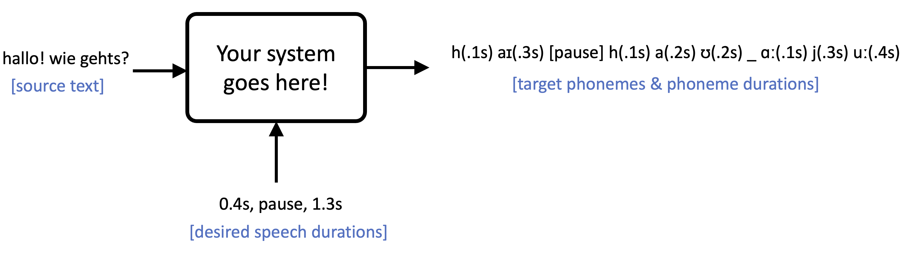

<!--
Markdown notes: comments can be formed as in this example;
bulleted lines start with a - ;
if you want to have a line break either put a blank line in between the text or leave two spaces at the end of the line
-->

## Description

This task focuses on **automatic dubbing**: translating the speech in a video into a new language such that the new speech is natural when overlayed on the original video. Automatic dubbing is a very [difficult/complex task](https://arxiv.org/abs/2212.12137), and for this shared task we will focus on the characteristic which is most unique to dubbing: **isochrony**. Isochrony refers to the property that the speech translation is time aligned with the original speaker’s video. When the speaker’s mouth is moving, a listener should hear speech; likewise, when their mouth isn’t moving, a listener should not hear speech. 

To make this task accessible for small academic teams with limited training resources, we make some simplifications: First, we assume the input speech has already been converted to text using an ASR system and the desired speech/pause times have been extracted from the input speech. Second, to alleviate the challenges of training a TTS model, the output is defined to be [phonemes](https://en.wikipedia.org/wiki/Phoneme) and their durations. These phonemes and durations will be played through [this open-source text-to-speech model](https://github.com/mtresearcher/FastSpeech2) to produce the final speech.

To illustrate, here’s an example in which “hallo! wei gehts?” is translated to “hi! how are you?” such that the output will fit in the desired target speech durations of 0.4s and 1.3s, with a pause in between:

## Data

Official training and test data can be found [here](https://github.com/amazon-science/iwslt-autodub-task/tree/main/data).

The training data is derived from [CoVoST2](https://arxiv.org/abs/2007.10310) and consists of:

* Source (German) text
* Desired target speech durations (e.g. 2.1s of speech, followed by a pause, followed by 1.3s of speech)
* Target (English) phonemes and durations corresponding to a translation which adheres to the desired timing

The test data consist of videos of native speakers reading individual German sentences from the CoVoST-2 test set. 

In order to make the shared task approachable for small academic teams, we will have a constrained setting in which participants may use only the official data listed above and may not use any pretrained models.

Additionally, we will have an unconstrained setting more inline with real world conditions where additional speech and parallel data is likely available.  In the unconstrained setting, participants may use any publicly available datasets or pre-trained models, as long as they are licensed for research purposes. 

## Baselines

Our baseline will consist of a simple encoder-decoder which takes in a source sentence and the desired speech durations and outputs alternating phones and phoneme durations. Code to replicate the baseline can be found [here](https://github.com/amazon-science/iwslt-autodub-task).

## Submission

Details TBA.

## Evaluation

Participant teams will submit English speech for a set of German videos, each containing one sentence from the CoVoST-2 test set. The new audio will be overlayed on the original video and the resulting video will be judged for it’s overall quality (both isochrony and translation quality). Exact details TBA. 

We will also report automatic metrics for each submission, for both machine translation quality and isochrony adherence. However, human judgements will be the primary evaluation method. 

## Organizers

* Brian Thompson (AWS AI Labs)
* Prashant Mathur (AWS AI Labs)
* Alexandra Chronopoulou (Center for Information and Language Processing, LMU)

## Contact

brianjt at amazon dot com
  
Discussion: <iwslt-evaluation-campaign@googlegroups.com>
