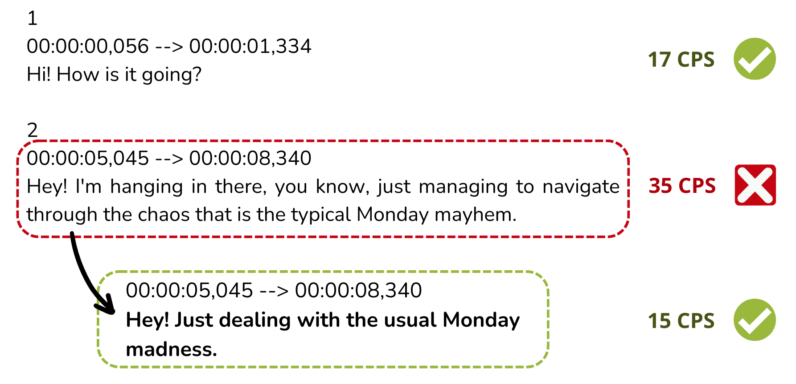

<!--
Markdown notes: comments can be formed as in this example;
bulleted lines start with a - ;
if you want to have a line break either put a blank line in between the text or leave two spaces at the end of the line
-->

[Last update: Dec 20, 2023]

## Description

<!-- Description the task, the languages, and the type of data -->

In recent years, the task of automatically creating subtitles for audiovisual content in another language has gained a lot of attention, as we have seen a surge in the number of movies, series, and user-generated videos being streamed and distributed all over the world. 
The task of automatic subtitling is multi-faceted: starting from the speech, not only does the translation have to be generated, but it must also be segmented into subtitles compliant with constraints that ensure high-quality user experience, like a proper reading speed, synchrony with the voices, the maximum number of subtitle lines and characters per line, etc.

This year, we propose two sub-tracks:
* **automatic subtitling**: similar to 2023, participants are asked to generate subtitles in German and/or Spanish of different kinds of audiovisual documents, featuring different levels of complexity, starting from English speech
* 🆕 **subtitle compression**: participants are asked to rephrase subtitles that are non-compliant with the reading speed constraint (at most 21 characters / second) to make them compliant

and two language directions:
* English -> German
* English -> Spanish

## Training and Data Conditions
### 🔵 AUTOMATIC SUBTITLING 🔵
Two training data conditions are proposed:
* **constrained**: the official training data condition, in which the allowed training data is limited to a medium-sized framework (described below) in order to keep the training time and resource requirements manageable
* **unconstrained**: a setup without data restrictions (any resource, pre-trained language models can be used) to allow also the participation of teams equipped with high computational power and effective in-house solutions built on additional resources

#### Training Data allowed for Constrained Conditions

| Data type | src lang | tgt lang | Training corpus (URL) | Version | Comment
| --- | :---: | :---: | --- | --- | --- |
| speech | en | -- | [LibriSpeech ASR corpus](http://www.openslr.org/12/) | v12 | includes translations into *pt*, not to be used
| speech | en | -- | [How2](https://github.com/srvk/how2-dataset) | na | |
| speech | en | -- | [Mozilla Common Voice](https://commonvoice.mozilla.org/en/datasets) | v11.0  | |
| speech | en | -- | [TED LIUM](https://lium.univ-lemans.fr/en/ted-lium3/) | V2/V3 | |
| speech | en | -- | [Vox Populi](https://github.com/facebookresearch/voxpopuli) | na | |
| speech-to-text-parallel | en | de | [MUST-C](https://mt.fbk.eu/must-c/) | v2.0/v3.0 |  |
| speech-to-text-parallel | en | de, es | [MUST-Cinema](https://mt.fbk.eu/must-cinema/) | v1.1 | with subtitle and line breaks |
| speech-to-text-parallel | en | de, es | [MUST-C](https://mt.fbk.eu/must-c/) | v1.2 | same as MUST-Cinema but without subtitle breaks |
| speech-to-text-parallel | en | de | [Speech Translation TED corpus](http://i13pc106.ira.uka.de/~jniehues/IWSLT-SLT/data/corpus/iwslt-corpus.zip) | na | |
| speech-to-text-parallel | en | de | [CoVoST](https://github.com/facebookresearch/covost) | v2 | only German translation, no English transcription |
| speech-to-text-parallel | en | de, es | [Europarl-ST](https://www.mllp.upv.es/europarl-st/) | v1.1 | |
| text-parallel | en | de | [Europarl](https://www.statmt.org/europarl/v10/training/europarl-v10.de-en.tsv.gz) | v10 | |
| text-parallel | en | es | [Europarl](https://object.pouta.csc.fi/OPUS-Europarl/v8/tmx/en-es.tmx.gz) | v8 | |
| text-parallel | en | de | [NewsCommentary](https://data.statmt.org/news-commentary/v16/training/news-commentary-v16.de-en.tsv.gz) | v16 | |
| text-parallel | en | es | [NewsCommentary](https://data.statmt.org/news-commentary/v16/training/news-commentary-v16.en-es.tsv.gz) | v16 | |
| text-parallel | en | de | [OpenSubtitles](https://apptek930-my.sharepoint.com/:u:/g/personal/ematusov_apptek_com/ESYWN8_BzeJAmBv4GcRapbsBeLpmLOd699qBc9_WG7Gifw?e=Bk6UWh) | v2018 apptek | partially re-aligned, filtered, with document meta-information on genre |
| text-parallel | en | es | [OpenSubtitles](https://apptek930-my.sharepoint.com/:u:/g/personal/ematusov_apptek_com/EafNtfaI0yNKgsoDIDTsEK8BelStVZVsZIrQcwjgTx5diA?e=BT97yx) | v2018 apptek | partially re-aligned, filtered, with document meta-information on genre |
| text-parallel | en | de | [TED2020](https://object.pouta.csc.fi/OPUS-TED2020/v1/tmx/de-en.tmx.gz) | v1 | |
| text-parallel | en | es | [TED2020](https://object.pouta.csc.fi/OPUS-TED2020/v1/tmx/en-es.tmx.gz) | v1 | |
| text-parallel | en | es | [Tatoeba](https://object.pouta.csc.fi/OPUS-Tatoeba/v2022-03-03/tmx/en-es.tmx.gz) | v2022-03-03 | |
| text-parallel | en | de | [Tatoeba](https://object.pouta.csc.fi/OPUS-Tatoeba/v2022-03-03/tmx/de-en.tmx.gz) | v2022-03-03 | |
| text-parallel | en | es | [ELRC-CORDIS_News](https://object.pouta.csc.fi/OPUS-ELRC-CORDIS_News/v1/tmx/en-es.tmx.gz) | v1 | |
| text-parallel | en | de | [ELRC-CORDIS_News](https://object.pouta.csc.fi/OPUS-ELRC-CORDIS_News/v1/tmx/de-en.tmx.gz) | v1 | |
| text-monolingual | -- | de | [OpenSubtitles with subtitle breaks](https://fbk.sharepoint.com/:u:/s/MTUnit/Efm0lF0ITTJeBM0ZmjlAKeEBu9CE33SCvb05S1tAq2AkSA?e=FHbZci) | v2018-apptek | superset of parallel data, with subtitle breaks and document meta-info on genre, automatically predicted line breaks |
| text-monolingual | -- | es | [OpenSubtitles with subtitle breaks](https://fbk.sharepoint.com/:u:/s/MTUnit/EXSih5zOAUZciBlO9HiXrJYBVYjjyRuEM7EK9c9BzpKD7w?e=MllfhK) | v2018-apptek | superset of parallel data, with subtitle breaks and document meta-info on genre, automatically predicted line breaks |

#### Development and Evaluation Data

Participants are asked to automatically subtitle in German and/or Spanish three kinds of audio-visual documents, where the spoken language is always English, featuring different levels of complexity: *(1)* TED talks from the MuST-Cinema corpus, *(2)* Peloton physical training videos, and *(3)* ITV entertainment series.

Audio-visual documents of development and evaluation sets are and will be provided in MP4 format; subtitles of development sets are released in SRT (SubRip File Format) UTF-8 encoded files, the same format required for submissions.

* [TED](https://www.ted.com/) is a new collection of audio recordings from English TED Talks, automatically aligned at the sentence level with their manual transcriptions and translations (into German and Spanish) marked with subtitle breaks.
  * As **dev** set, 17 video recordings and subtitles (in English, German and Spanish) of the TED talks defining the evaluation set of the Offline Speech Translation task at IWSLT 2022 (total duration: about 4 hours) can be downloaded from [here](https://fbk.sharepoint.com/:u:/s/MTUnit/EYVU_jLDOdte0LhVQiDAhUYBGDoQdsrZExZJztTs3SMHcw?e=UhsODW).
  * The **test** set will be released soon ⏳ 

* [Peloton](https://www.onepeloton.com/) is a US company that offers fitness training equipment as well as on-line fitness classes which are provided with subtitles in different languages. Peloton is interested in research related to the use of automated subtitling technology in their translation workflows. We would like to thank Peloton for providing IWSLT with samples of their videos for research and evaluation purposes and would like to ask you not to use these videos or subtitles for any commercial purposes or make them publicly available on any other website.  

  * As a **dev** set, 9 recordings of fitness training videos (mostly single-speaker - the fitness instructor) and corresponding subtitles (in English, German and Spanish) for a total duration of about 4 hours can be downloaded from [here](https://fbk.sharepoint.com/:u:/s/MTUnit/ESITGO_X_S1QhmBxE7ZkLuABq4O8fFD_iOIa7TKIqUV88w?e=cIvER3). **Note**: the **English** SRT files are **not** properly segmented according to the usual subtitle and line segmentation guidelines and are provided for informational purposes only. The German and Spanish SRT files are the ones created by professional subtitle translators.
  * The **test** will be released soon ⏳

* [ITV Studios](https://www.itvstudios.com/) is part of ITV Plc, which includes the UK’s largest commercial broadcaster. They create and produce a broad range of programming (drama, entertainment, factual) in 13 countries, which they distribute globally, providing high-quality subtitles. We would like to thank ITV Studios for providing IWLST with samples of their video content for research and evaluation purposes and would like to ask you not to use these videos and/or the accompanying subtitles for any commercial purposes or make them publicly available on any other website. 

  * As a **dev** set, 7 episodes of 3 different television series, with an approximate duration of 7 hours in total, can be downloaded from [here](https://fbk.sharepoint.com/:u:/s/MTUnit/EZXtQE00-Z5VP5Stmbhw1Y4BI3k6WyppWs0_cSCCBbwjyQ?e=nxIqkf). **Note**: some of the **English** SRT files were created following different subtitling guidelines than the ones used in this evaluation (e.g. they contain subtitles with 3 lines) and are provided for informational purposes only.
  * The **test** will be released soon ⏳

When available, English subtitles of development sets are released only for the convenience of participants; it is not required to generate them for the final evaluation.

### 🔵 🆕 SUBTITLE COMPRESSION 🔵

This year, we propose a new simplified sub-track where participants are asked to rephrase subtitles that are non-compliant with the reading speed constraint (> 21 CPS) to make them compliant. In this sub-task, time boundaries do not have to be changed: only the text, in a given time span, has to be compressed when necessary.

The conditions for the sub-track are:
* Participants are provided with original AV docs (the same released for the Automatic Subtitling sub-track) and subtitles to be corrected
* No indication is given on which subtitles need to be corrected: all of them can be processed but participants can decide to process only a portion on the basis of the CPS values (computed with the [subtitle compliance script](https://github.com/hlt-mt/FBK-fairseq/blob/master/examples/speech_to_text/scripts/subtitle_compliance.py) by [Papi et al., 2023](https://doi.org/10.1162/tacl_a_00607))
* A wide range of solutions can be adopted, without limitations on the training data conditions, and including the use of LLM prompted for text compression (e.g. [chatGPT](https://chat.openai.com/chat))
* The original audio, though potentially helpful, can either be used or not by participants, which can also be transcribed with external tools (e.g. [Whisper](https://github.com/openai/whisper))

The following is an example of a non-conform subtitle block (dashed red) with 35 CPS, thus exceeding the 21 CPS limit, that is replaced by a conform subtitle (dashed green) with 15 CPS. Timestamps remain unchanged while the text has been compressed to not exceed the 21 CPS limit while conveying the same meaning.


* The texts present in the image are in English only for explanation purposes 

 


<br/>
<br/>
Subtitles to be corrected will be generated by means of a non-participating system to the Automatic Subtitling track.
<br/>
<br/>

⏳ *Data will be released in January*


## Submission

* Multiple run submissions are allowed, but participants must explicitly indicate one PRIMARY run; all other run submissions are treated as CONTRASTIVE runs. In the case that none of the runs is marked as PRIMARY, the latest submission (according to the file timestamp) will be used as the PRIMARY run
* Submissions have to be sent as a gzipped TAR archive (see format below)
* Submission files have to be stored as SRT (SubRip File Format) UTF-8 encoded files
* For each element of test sets, provide the subtitles in an SRT file whose name includes the file identifier (number) of the video

TAR archive file structure:
```
< UserID >/< Set >_< VdId >.< Lang >.< UserID >.primary.srt 
  /< Set >_< VdId >.< Lang >.< UserID >.contrastive1.srt  
  /< Set >_< VdId >.< Lang >.< UserID >.contrastive2.srt  
  /...  
```
where:
```
< UserID > = user ID of participant; use the short name chosen in the registration form
< Set > = IWSLT23.Subtitling.< Domain >tst
< VdId > = numeric identifier of the video
< Domain > = one of {TED, Peloton, ITV}
< Lang > = one of {en-de.de, en-es.es} (ISO 639-1 two-letter codes of languages)
```
Example: 
```
FBK/IWSLT23.Subtitling.TEDtst_13587.en-de.de.FBK.primary.srt
```

Submissions must be sent as an email attachment to these two addresses:  
* *cettolo AT fbk DOT eu*  
* *ematusov AT apptek DOT com*

The email should also include the following information:

* Institute/Company:
* Contact Person:
* Email:
* Track: Automatic Subtitling/Subtitle Compression
* (For participants to the Automatic Subtitling sub-track) Data condition: Constrained/Unconstrained
* Brief abstract about the system:
* Do you want to make your submissions freely available for research purposes? (yes/no)


## Evaluation

The evaluation of subtitling quality is a complex problem on its own since both the translation quality and the compliance with subtitling constraints have to be considered at the same time. 
We adopt the following metrics, where limits of acceptability for the conformity metrics (LPB, CPS, CPL) are set following the [TED guidelines](https://www.ted.com/participate/translate/subtitling-tips):
* [**SubER**](https://github.com/apptek/SubER): the **primary metric** of the task, for measuring the overall quality of automatically generated subtitles
* [**BLEU**](https://github.com/mjpost/sacrebleu) and [**BLEURT**](https://github.com/google-research/bleurt): for measuring the translation quality, automatic subtitles will be realigned to the reference subtitles using [mwerSegmenter](https://www-i6.informatik.rwth-aachen.de/web/Software/mwerSegmenter.tar.gz) ([Matusov et al., 2005](https://aclanthology.org/2005.iwslt-1.19.pdf)) before running these metrics
* **LPB**: the percentage of subtitles not exceeding 2 lines per subtitle, computed with the [subtitle compliance script](https://github.com/hlt-mt/FBK-fairseq/blob/master/examples/speech_to_text/scripts/subtitle_compliance.py) ([Papi et al., 2023](https://doi.org/10.1162/tacl_a_00607))
* **CPL**: the percentage of subtitles not exceeding 42 characters per line, computed with the [subtitle compliance script](https://github.com/hlt-mt/FBK-fairseq/blob/master/examples/speech_to_text/scripts/subtitle_compliance.py) ([Papi et al., 2023](https://doi.org/10.1162/tacl_a_00607))
* **CPS**: the percentage of subtitles not exceeding 21 characters per second, computed with the [subtitle compliance script](https://github.com/hlt-mt/FBK-fairseq/blob/master/examples/speech_to_text/scripts/subtitle_compliance.py) ([Papi et al., 2023](https://doi.org/10.1162/tacl_a_00607))
  
Scoring will be case-sensitive and will include the punctuation.
For the subtitle compression sub-track, only BLEURT and CPS are used and considered both as **primary scores**.

It is expected that participants will use only the audio track from the provided videos (dev and test sets), the video track being of low quality and provided primarily as a means to verify time synchronicity and other aspects of displaying subtitles on screen.

## Organizers

<!-- List of organizers' names and affiliations -->
* Mauro Cettolo, FBK
* Evgeny Matusov, AppTek
* Matteo Negri, FBK
* Sara Papi, FBK, University of Trento
* Marco Turchi, Zoom Video Communications
* Patrick Wilken, AppTek

## Contact

<!-- Add chair(s) and their contact info, as well as standard google group -->
Chairs: 
* Mauro Cettolo, FBK, Italy
* Evgeny Matusov, AppTek, Germany
  
Discussion: <iwslt-evaluation-campaign@googlegroups.com>
